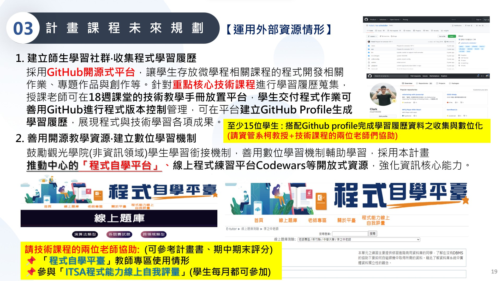

# 112教育部智慧創新計畫
<a href="http://140.126.146.12:9090/GitHub2023/">112教育部智慧創新之GitHub學習平台</a>&nbsp;<a href="https://chat.openai.com/auth/login">技術諮詢</a> <table>   <tr>     <th>系級</th>     <th></th>     <th><a href="">學習履歷</a></th>     <th><a href="https://chat.openai.com/">好友</a></th>   </tr>   <tr>     <td><a href="https://hm.chu.edu.tw/index.php?Lang=zh-tw">餐旅系</a></td>     <td><a href="https://www.youtube.com/watch?v=dK9rBfbUETw">報告</a></td>     <td><a href="">創意擂台暨永續行動</a></td>     <td>林0均</td>   </tr>   <tr>     <td><a href="https://lm.chu.edu.tw/index.php?Lang=zh-tw">餐旅系</a></td>     <td><a href="https://lm.chu.edu.tw/p/412-1040-117.php?Lang=zh-tw">實習</a></td>     <td><a href="">餐廳實習</a></td>     <td>潘0萱</td>   </tr>      <tr>     <td><a href="https://mice.chu.edu.tw/index.php?Lang=zh-tw">餐旅系</a></td>     <td><a href="https://mice.chu.edu.tw/p/412-1041-112.php?Lang=zh-tw">外籍學生</a></td>     <td><a href="">其他</a></td>     <td>王O仁</td>   </tr>   </table>   </img> </img> </img> 
- 🔭 I’m currently working on ...
- 🌱 I’m currently learning ...
- 👯 I’m looking to collaborate on ...
- 🤔 I’m looking for help with ...
- 💬 Ask me about ...
- 📫 How to reach me: ...
- 😄 Pronouns: ...
- ⚡ Fun fact: ...
-->
